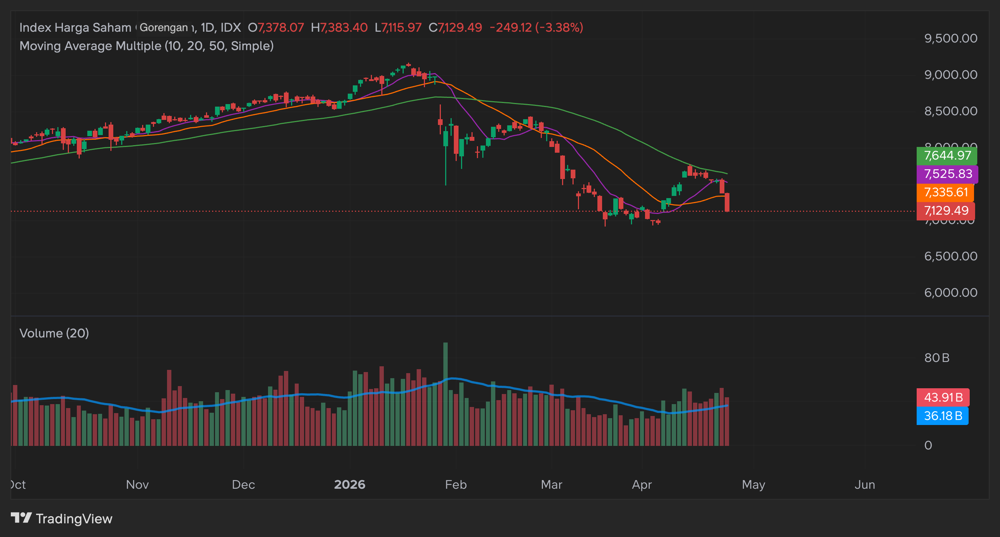

<!-- 
OUTLINE & WRITING NOTES
========================
Target: ~3000-3500 words, 12-17 min read.
Voice: personal, raw, honest. not a tutorial. not a tech showcase.
Audience: devs who invest, AI practitioners, tech-savvy IDX retail.
Also serves as: portfolio piece. reader should think "this person built something serious."

TECHNICAL DEPTH CALIBRATION:
- Story-driven narrative with enough technical substance to prove you built it.
- Rule of thumb: NAME things, don't EXPLAIN them.
  "Wyckoff state detection" shows you know what it is. Explaining Wyckoff theory is a different article.
  "CADI (cumulative accumulation/distribution)" shows the flow analysis is real. How CADI is computed is too deep.
- Per section:
  * Intro + Why Agentic AI → no technical terms. pure story.
  * Four Lenses → conceptual but show the framework is formalized. mention skill structure, lens roles,
    one concrete example (e.g., narrative regime taxonomy). don't show prompt content.
  * What the AI Actually Does → portfolio flex section. name the three apps, the data pipeline categories,
    Playwright+CDP pattern, deterministic preprocessing (name: Wyckoff, VPVR, CADI, trust regime),
    memory artifacts, parallel subagents, OpenCode, OpenRouter. show engineering depth without tutorials.
  * What 80+ Sessions Taught Me → BUMI is concrete enough. mention triage system names
    (NO_CHANGE/MONITOR/ATTENTION/EXIT_SIGNAL). the role change quote.
  * Verdict → no technical terms. close the loop.

STRUCTURE:
1. Intro — The Expensive Lesson (keep as-is, it's good)
2. Why Agentic AI? (keep + tighten)
3. Four Lenses of IDX (conceptual but formalized)
4. What the AI Actually Does (tooling + memory + iteration pain, woven together)
5. What 80+ Sessions Taught Me (BUMI → breakdown → redesign → lessons, ONE section)
6. Verdict (close the loop)
-->

As an apestor who was taught to focus on fundamentals, I only knew two stocks: BBCA and BMRI. Everything else? too scary. So when the prices went down, I averaged down. Dollar Cost Averaging (DCA) as people says. Good fundamental stock will recover eventually, right? maybe in 3 years, 5 years, or even 10 years.

Around September or October 2025, IHSG rallied 20%+ and **my portfolio was still red**. Bull market euphoria is peaking to the point I'm seeing someone on social media says "even a monkey can profit in this market". So, I was dumber than a monkey? (maybe yes).

Naturally, I did the smartest thing possible: joined the late-stage rally. Bought crowded, rumour-driven stocks at all-time highs. No thesis, no discipline, just borrowed conviction from strangers on the internet. IDX is an interesting gambling arena. Then the MSCI rebalancing freeze hit, and the rest is history. Maybe we forgot that gambler loses in the end.

Expensive lesson. But since I already paid the tuition upfront, might as well learn from it. The post-mortem was obvious: no system, no real research process, no position sizing rules, no invalidation criteria — just vibes and hope. Heck, even the post-mortem is full of LLM judging and roasting me for all the stupid decisions. To do this properly, I'd need a structured workflow: thesis formation, evidence gathering, risk management, ongoing monitoring. That's a lot of work for one person tracking 20+ stocks.

So here's the idea: what if I don't do it alone? What if I build an AI that does the homework — gathers the evidence, runs the analysis frameworks, maintains the notes — and I make the decisions? Materialize the entire investment process into prompts, skills, and tools. A second brain. We're in the **Agentic AI** era anyway. Complex workflow can be automated. We can give an AI agent the same information streams that a human use and let it run our system.

Yes, we are re-experimenting other people experiment on "can LLM used for investment?". We'll see how it goes, and more importantly, at least it's useful for me. And thus, the **Vibe Investing** term. Like "vibe coding", but for the stock market.

## Why Agentic AI?

There are several fundamental ideas with this AI:

- Agentic AI means giving the AI a set of problem, prompt, and tools and let it perform autonomous action to achieve the goal or solve the problem.
- That being said, benchmarks shows that doing investing with AI is no better than coin flip. Remember the LLMs trading experiment? (todo find the link). In short, it's not an ideal solution. Instead of relying on LLM knowledge, can we supply the AI with the relevant knowledge? (almost) exactly the same if a real human doing the analysis. All the information stream. Then, instead of relying at the mercy of the LLM, we prepare a set of workflow, rules, prompt that replicates how a human usually do analysis and make the AI do it.
- LLM is a smart goldfish. So we need a memory system, just like how human write down notes. but this system requires both human and LLM can collaborate together in a way that understood by both and optimized for LLM as well. Lucikly, I'm a programemr so I live in VS Code and take notes in markdown file. LLMs is goot ad CLI and filesystem operations. Just give it a folder/workspace to work on and some foldering structure and there you go.
- What I wanted: an AI that can gather evidence, track theses, monitor 20+ symbols, and help me make better decisions. Traditional ML can't judge narrative. and I'm not a quant and not good at math anyway.

<!-- 
NOTE: this section is solid. maybe add one line about the scale of the project:
"3 months, 600+ commits, 3 separate apps, and a lot of pain later — here's what I built and what I learned."
to set expectations for the reader.
-->

## Four Lenses of Indonesia Stock Market

<!--
WRITING DIRECTION: conceptual but show the framework is formalized, not vibes.
the reader should understand the framework AND believe you actually built it.
~500 words.

DEPTH: name the skill structure, mention lens roles, give one concrete example.
don't show prompt content or code. but make it clear these are structured analytical frameworks
with specific output contracts, scoring rubrics, and evidence hierarchies — not just "ask ChatGPT about stocks."
-->

Smaller market caps and liquidity. Price often driven by narratives, bandar, money flow, informed player, not just fundamentals.

<!--
expand here: IDX is not NYSE. a fundamentally excellent stock can bleed under distribution.
a mediocre stock can rally hard on accumulation plus story. if you only look at fundamentals,
you're playing with one eye closed. so we need multiple lenses.
-->

then mention about fundamental, technical, flow, and narrative.

<!--
explain each lens briefly — what question it answers:
- Narrative: "what's the story? what's the catalyst? is it priced in?" — usually the thesis anchor.
  concrete example to show depth: "the narrative skill classifies stories into regimes —
  THEME_OR_ROTATION, TURNAROUND, CORPORATE_ACTION, POLICY_OR_INDEX_FLOW, RERATING_OR_YIELD,
  SPECULATIVE_HYPE — before scoring strength, stage, durability, and crowding as separate dimensions."
- Technical: "when do we enter/exit? where's the invalidation?" — timing and risk placement.
  mention: deterministic preprocessing computes Wyckoff state, S/R zones, VPVR, setup families.
  the LLM interprets the pre-computed context, never touches raw price data.
- Flow: "what are informed players doing? accumulation or distribution?" — the IDX-specific edge.
  mention: broker-flow analysis with CADI, persistence scoring, trust regime, wash-trade detection.
  (credit for idea from idx flow kangritel)
- Fundamental: "is the business worth owning? is the price reasonable?" — the validation layer.
  mention: multiple valuation methods, financial quality checks, governance/ownership analysis.

key insight to highlight: not all lenses matter equally for every stock.
for a gold thesis, narrative anchors. for a deep-value play, fundamental anchors.
the AI assigns "lens roles" per symbol — which lens leads, which confirms, which is noise.
this is a real design pattern: thesis anchor / timing and risk / confirmation / validation / noise.
-->

this lenses is materialized into skill.

then explain the AI agent skills. plus the portfolio management skill.

<!--
keep this brief. each lens becomes a "skill" — a structured prompt loaded on-demand with domain knowledge,
scoring rubrics, evidence hierarchies, and output contracts. not a chatbot conversation.
the narrative skill alone has 5 reference documents covering core framework, premium/hype lifecycle,
rights issues, backdoor listings, and IPO analysis. fundamental has 13 reference docs across
valuation methods, sector-specific playbooks (banking, coal, gold, property, etc.), and risk frameworks.

portfolio management is the fifth skill: constraint math (position sizing, risk budgets, regime aggression
based on IHSG state), not decision making. PM tells you "here's how much room you have and what the
risk math looks like", not "buy this."

mention: built on OpenCode (agentic coding framework), single agent with on-demand skills,
not multi-agent. skills are loaded as tool results and protected from context window compaction.

[TODO: diagram — four lenses converging on a symbol, with lens roles labeled]
-->

## What the AI Actually Does

<!--
WRITING DIRECTION: this is the portfolio flex section. show engineering depth without tutorials.
merge old "Tooling", "Memory", and "Other AI Component" into one narrative.
the reader should understand the daily workflow and the key design choices,
and come away thinking "this person built real infrastructure."
~600-700 words.

DEPTH: name the three apps (vibe-investor, kb-backend, ai-client-connector) and what they do (one sentence each).
name specific patterns: Playwright+CDP, deterministic preprocessing, filesystem-based memory.
name specific artifacts: ta_context.json, flow_context.json, plan.md, thesis files.
name frameworks: OpenCode, OpenRouter. don't explain how to set them up.

structure within this section:
1. brief system overview (three apps, one sentence each)
2. how it gathers evidence (data sources, conceptual but name the categories)
3. the key design insight: deterministic preprocessing
4. how it remembers (memory architecture, name the artifacts)
5. the daily workflow + iteration pain (woven in as color)
-->

### How It Gathers Evidence

<!--
start with a one-liner system overview:
"three apps: vibe-investor (the AI agent, built on OpenCode), kb-backend (knowledge base + market data APIs,
Elysia + FastMCP + PostgreSQL), and ai-client-connector (browser automation for data capture, Playwright + CDP)."
-->

Idea: we want the AI to be able to "see" the same thing that human do. either the news, the current portfolio state, the chart, etc.

Scraping some questionable things. Build RAG and historical data.

- Document ingestion: news, analysis, rumors — each as distinct evidence classes.
- multiple brokerage research sources, corporate filings, social media, newsletters
- each document type has a trust level: official filings > broker research > news > social > rumor

<!-- 
keep this high-level but name enough to show scale:
"8+ automated ingestion pipelines covering brokerage research, corporate filings, premium analysis,
social media (Twitter/X, Stockbit), YouTube, Telegram, and newsletters. each document is classified
by type (news, analysis, rumor, filing) and tagged with relevant stock symbols and sectors.
documents are embedded into a vector store for semantic search alongside keyword (BM25) retrieval."

mention the evidence hierarchy — this is a real design choice:
"official filings > company guidance > internal analysis documents (our data edge) > news > social > rumor.
when claims conflict, higher-tier evidence wins. if a thesis depends mainly on rumors, confidence stays low."

don't name specific brokers or pipeline internals. "8+ sources" is enough.
-->

split the we ingest it and the fetch from internet: twitter, exa. the list filing tool. deep document extract, etc.

caveat on scraping. argue on agentic coding user is legit, but the control is different. I just opened the app in my browser, but lucikly I can read the network tab and see the raw response and use that. ha! I'm a real user.

<!--
the browser automation hack — name the tech, it's a cool pattern:
"ai-client-connector uses Playwright attached to my actual Brave browser session via Chrome DevTools Protocol (CDP).
it intercepts API responses I'd normally see in the network tab — portfolio state, trade history, auth headers —
and feeds them into the system. no credential automation, no spoofing. I'm a legitimate user who happens to
read the network tab programmatically."

this is portfolio-worthy: shows you understand CDP, browser automation, and creative data acquisition.
-->

### The Key Design Insight: Don't Let the LLM Do Math

<!--
THIS IS THE MOST IMPORTANT TECHNICAL POINT IN THE ARTICLE.
the idea that makes this a portfolio piece, not just a blog post.

"for technical analysis: Python scripts (build_ta_context.py, generate_ta_charts.py) compute everything
deterministic — Wyckoff state machine, support/resistance zone detection, Volume Profile Visible Range (VPVR),
setup family classification (5 canonical setups), MA posture, red flag detection — and output a structured
ta_context.json plus PNG chart images. the LLM reads the pre-computed context and interprets what it means
for the thesis. it never touches raw OHLCV data directly.

for flow analysis: same pattern. build_flow_context.py computes CADI (cumulative accumulation/distribution),
persistence scoring, trust regime calibration, wash-trade probability, divergence detection, and participant
flow breakdown (foreign/government/local) — outputs a verdict-first flow_context.json. the LLM reads the
verdict, checks trust level, and drills into signals only when something contradicts the conclusion.

for fundamental analysis: the deterministic layer is the MCP tools themselves — get-stock-financials,
get-stock-governance, get-stock-keystats return structured data. the LLM computes valuation methods
and synthesizes quality/risk verdicts from the structured inputs."

why this matters: "LLMs are bad at math but good at interpretation and judgment.
deterministic scripts are good at math but can't judge narrative or weigh conflicting evidence.
split the work along those lines. this single design choice eliminated most of the hallucination
and inconsistency problems in the technical and flow analysis."

[TODO: simple diagram — "raw OHLCV → Python script → ta_context.json + charts → LLM interpretation → plan.md"]
-->

predefined script. chart generation. skill content. prefiltered technicla anlaysis school of thought.

Fetch the raw olhcv. can let the AI run python code to run dynamic things.

credit for idea from idx flow kangritel. fetch broker flow.

market pulse, portfolio state, note state (get_state). fundamental tools, keystats, profile, goverance, etc.

### How It Remembers

<!--
name the artifacts and the pattern. show it's a real system, not just "save stuff to files."

key points:
- LLM is a smart goldfish. every new session starts from zero unless you give it memory.
- filesystem-based: markdown files + JSON artifacts. human-readable, LLM-readable, git-trackable.
  "I'm a programmer, I live in VS Code, I take notes in markdown. LLMs are good at CLI and filesystem.
  just give it a folder structure and let it read/write."
- symbol plans (memory/symbols/{SYMBOL}/plan.md): living documents that accumulate the AI's understanding
  across sessions. contains all four lens summaries with scores, active scenarios, position management,
  per-lens reasoning history with dated entries. critical rule: never overwrite on update, only surgical edits.
  "no update is a valid outcome — if nothing changed, bump the review date and stop."
- thesis files (memory/theses/{THESIS_ID}/thesis.md): multi-symbol umbrella views with evidence logs.
  e.g., "gold diversification" thesis covering MDKA, ARCI, BRMS.
- market-level artifacts: IHSG regime assessment, macro stance, operating levels, narrative state.
- news digests (memory/digests/): dated summaries with thesis impact maps — "for each active thesis,
  what changed this window and is it strengthening or weakening?"
- get_state tool: reads all frontmatter across all symbol plans and thesis files, computes staleness
  warnings, surfaces status mismatches. one call gives the AI a complete view of what it knows and
  what's overdue for review.

the punchline: "memory architecture matters more than prompt engineering.
without memory, you're paying for a genius that forgets everything every hour."

[TODO: simplified diagram — memory folder tree or data flow between sessions]
-->

- Symbol plans as durable operating state
- Thesis files with frontmatter contracts
- Market-level artifacts (IHSG plan, desk check summaries)
- Run logs for workflow continuity
- Why memory architecture matters more than prompt engineering

### The Daily Workflow

<!--
name the workflow and show the system is operational, not theoretical.

desk-check — the main daily routine:
1. news digest: gather documents since last session from knowledge base (list-documents, search-documents),
   social signals via subagent (Twitter list CLI + Stockbit stream), triage by thesis relevance.
   writes a dated digest to memory/digests/ with thesis impact map.
2. digest sync: compare digest findings against active thesis files, update evidence logs.
3. market context: run market-pulse tool (batch OHLCV for all watchlist symbols + trending stocks +
   screeners + deterministic alerts in one call), portfolio state check, IHSG regime assessment.
4. symbol reviews: delegated to parallel subagents via task tool. each subagent reviews a batch of 3-5 stocks,
   runs TA + flow + narrative skills, writes/updates memory artifacts. spawned in parallel for speed.
5. synthesis: triage urgency — NO_CHANGE (one-liner), MONITOR (brief note), ATTENTION (full review),
   EXIT_SIGNAL (direct exit recommendation). on a typical day, most symbols are NO_CHANGE.

other workflows: deep-review (monthly full audit), explore-idea (discovery of new candidates),
memory-maintenance (schema drift fixes, staleness cleanup).

the iteration pain lives here naturally:
"222 commits in 3 months. 15 commits in a single day, most of them just 'update prompt'.
the loop: run a session, behavior drifts, analyze the session transcript, patch the prompt, repeat.
even simplifying a prompt introduced significant behavior regression.
monkey patching everywhere — WAIT ladders, weight rebalancing, 'don't default to inaction'.
each band-aid a commit."
-->

basic prompting, command design for common workflow, subagent design, opencode, etc.

it's a hellish iteration. loop after loop and monkey patching of prompts. another deep research reiterate, analyze existign session, correct the behaviour. even prompt simplification introduce significant behaviour regression.

## What 80+ Sessions Taught Me

<!--
WRITING DIRECTION: this is the climax. ONE section that covers evaluation → breakdown → redesign → lessons.
the arc: BUMI hooks the reader → pattern emerges → why it broke → what changed → takeaways.
~700 words.
-->

below is the AI slop. initial make the AI as decision maker but it's supit.

<!-- 
start with: the initial design had the AI as portfolio manager. it produced composite scores
(weighted average of all four lens scores), action tiers (BUY/WAIT/SELL), and position sizing
recommendations. sounds great on paper. 80+ sessions later, here's what actually happened.
-->

### BUMI — The Stock That Exposed Everything

- The stock that exposed everything: BUMI went 136→484 (+256%), AI WAITed through the entire move
- Only entered at 242 after I pushed twice, with a trivially small position
- Exit at 452 before a -43% crash was excellent
- The pattern: decisive on exits, paralyzed on entries

but well, in recent BULL rally, the HUMAN WAITed too much too and see the stock move. so maybe LLM is not that different anyway from human lol.

<!-- [TODO: BUMI price chart with AI decision points marked, if you have the data] -->

### Why It Broke

<!--
merge the old "Where LLMs Break Down" content here, but frame it as the explanation for BUMI.
not a separate abstract section — it's the "why" after the "what".
-->

- Entry decisions are inherently ambiguous — that's why the opportunity exists
- The system converted judgment into scores, averaged them, and checked thresholds
- Conflicting signals → middling scores → inaction
- The AI couldn't distinguish noise from signal in context (coal earnings miss vs gold thesis)
- Band-aids accumulated: WAIT ladders, weight rebalancing, "don't default to inaction"

<!--
add: the fundamental problem is that LLMs hedge when uncertain. and entry decisions are inherently uncertain —
that's literally why the opportunity exists. if it were obvious, the price would already reflect it.
so asking an LLM "should I buy?" is asking it to resolve the exact ambiguity that creates the opportunity.
it will always say "wait for more confirmation." and by the time confirmation arrives, the move is done.

the scoring trap: four lenses each produce a 0-100 score. average them. check against a threshold.
but conflicting signals (strong narrative + weak flow + neutral TA + decent fundamental) produce a
middling composite score every time. the system was structurally biased toward inaction.
-->

### What Changed

<!--
merge the old "Redesign" content here. frame it as the direct response to the BUMI lesson.
-->

- AI as research analyst and risk manager, not portfolio manager
- Thesis-first: define the thesis, filter all signals through thesis relevance
- Lens roles: narrative anchors, TA informs timing, flow informs sizing, fundamental validates
- Triage: most symbols get a one-liner, only material changes get full reviews
- Human decides entries, AI executes and monitors
- Scores become diagnostics, not decisions

<!--
add: the pivot commit was "update the AI role" — the prompt went from
"you are an investment analyst and portfolio manager" to
"you are a research analyst, not a portfolio manager. you do not decide whether to enter."

the triage system replaced the old "review everything equally":
NO_CHANGE (thesis intact, nothing new) → one-line status
MONITOR (something shifted, no decision needed) → brief note
ATTENTION (material change, new tension) → full review with human_attention flag
EXIT_SIGNAL (lenses converging negative) → direct exit recommendation

the AI is now excellent at: gathering evidence fast and in parallel, organizing findings into
structured reviews, surfacing tensions honestly when lenses disagree, monitoring positions for
deterioration, and executing the human's decisions with proper risk math (stop levels, position sizing,
regime-adjusted aggression).

it's bad at: resolving ambiguity, making entry calls, distinguishing noise from signal when context is mixed.

so we stopped asking it to do the thing it's bad at. No-as-a-Service.
-->

### The Takeaways

<!--
merge the old "Lessons for AI Agent Design" here. keep it tight — these should land as punchlines,
not as a separate listicle section.
-->

- Know what your AI is good at and design around that
- Don't ask LLMs to resolve ambiguity — they'll hedge
- Separate evidence gathering from judgment
- Memory and tooling matter more than prompt tricks
- The best AI assistant knows when to hand the decision back to the human

<!--
maybe add:
- deterministic preprocessing > letting LLM do math (callback to the earlier section)
- the iteration never ends. 222 commits and counting. but each iteration makes the system slightly less stupid.
- contract hygiene matters: who owns what? one owner per contract. base prompt owns identity and global rules,
  workflow files own execution order, skill files own domain knowledge. when you duplicate rules across layers,
  they drift and contradict each other.
-->

## Verdict

verdict: is it worth it? is it useful?

<!--
close the loop back to the intro. suggested direction:

the AI didn't make me money directly. the system I built for the AI made me a better investor.
building it forced me to formalize everything: what's my thesis? what's the invalidation?
what evidence would change my mind? what's my position sizing logic?

before this, I was "BBCA and BMRI, average down, hope for the best."
now I have a system that tracks 20+ symbols across four analytical lenses, maintains durable thesis files
with evidence logs, monitors for deterioration via deterministic alerts, and tells me when something
needs my attention. the AI does the homework. I make the decisions.

"the expensive lesson from the market was the tuition. the AI was the homework."

is it worth it? 3 months, 600+ commits across 3 apps, mass amount of prompting iteration, self-hosted infra.
for the investing returns alone, probably not yet.
but for learning how to think about markets systematically, and for learning where AI agents actually
break down when you throw them at a genuinely ambiguous real-world problem — absolutely.

the code is at [TODO: github link if you want to share, or just mention it's a personal monorepo].

[TODO: maybe end with a forward-looking line about what's next, or just leave it honest and open]
-->

answer: i don't know lol. it take months, lots of iteraiton, overengineering, and it might be better to just focus on learning the investing instead of building the AI haha. but well it is waht it is and at least now its usable (doesn't mean profitable yes)
